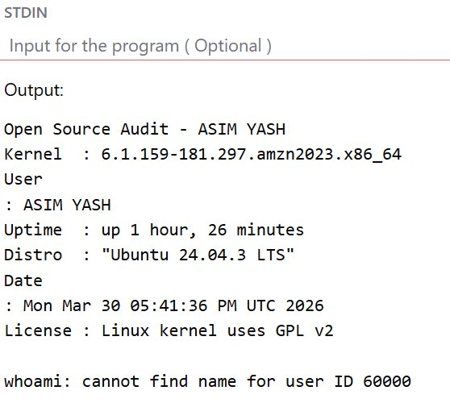
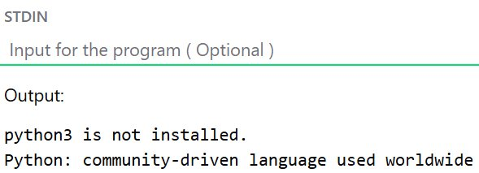
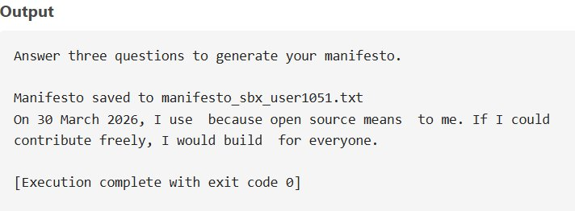
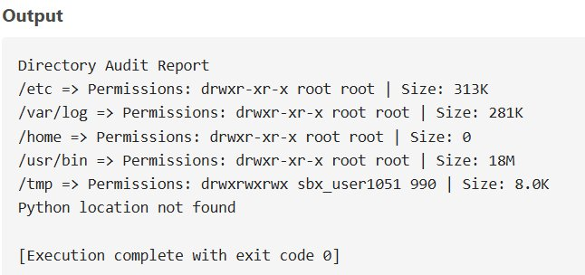
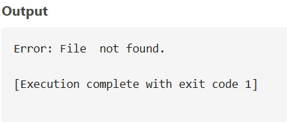

# OSS-Audit-ASIM-YASH
# Author: ASIM YASH
**Course:** Open Source Software (NGMC)  
**Chosen Software:** Python  

---

## What this is

This repo is my submission for the OSS Capstone project. I picked Python as my software — it is one of the most widely used open-source programming languages in the world, powering everything from web development and automation to data science and artificial intelligence. Its community-driven development model and permissive PSF license make it a compelling subject for an open-source audit.

The repo has five shell scripts that cover the practical Linux side of the project. The written report is submitted separately as a PDF on the VITyarthi portal.

---

## Scripts

### script1_system_identity.sh
Displays a formatted system identity report including kernel version, logged-in username, uptime, distro name, current date, and the Linux kernel license (GPL v2). Uses command substitution and standard shell variables.

Run it:
```bash
chmod +x script1_system_identity.sh
./script1_system_identity.sh
```

**Output:**



---

### script2_package_inspector.sh
Checks whether `python3` is installed using `dpkg`. If installed, it shows version and maintainer details; if not, it reports the package as missing. Uses a `case` statement to print a short description of the package.

Run it:
```bash
chmod +x script2_package_inspector.sh
./script2_package_inspector.sh
```

**Output:**



---

### script3_disk_auditor.sh
Loops through key system directories (`/etc`, `/var/log`, `/home`, `/usr/bin`, `/tmp`) and reports permissions, owner, and size for each. Also checks whether the Python 3 binary exists at `/usr/bin/python3` and prints its details if found.

Run it:
```bash
chmod +x script3_disk_auditor.sh
./script3_disk_auditor.sh
```

**Output:**



---

### script4_log_analyzer.sh
Accepts a log file path and an optional keyword (defaults to `error`) as arguments. Reads the file line by line, counts keyword matches, and prints the last 5 matching lines. Exits with an error message if the specified file is not found.

Run it:
```bash
chmod +x script4_log_analyzer.sh
./script4_log_analyzer.sh /var/log/syslog error
```

If you don't have `/var/log/syslog`, try `/var/log/messages` or any other log file on your system.

**Output:**



---

### script5_manifesto.sh
Interactive script that prompts the user with three questions (open-source tool they use daily, what freedom means to them, and something they'd build and share freely). Generates a personalised open-source manifesto paragraph and writes it to `manifesto_$(whoami).txt` in the current directory.

Run it:
```bash
chmod +x script5_manifesto.sh
./script5_manifesto.sh
```

**Output:**



---

## Dependencies

Just bash and standard Linux utilities — nothing extra to install. `dpkg` needs to be present for script 2 (it will be on any Debian/Ubuntu-based system). For RPM-based systems, swap `dpkg -l` for `rpm -q` in script 2.

Tested on Ubuntu 24.04.3 LTS (x86\_64) and an online Linux compiler environment.

---

## Notes

- All scripts need execute permission (`chmod +x`) before running
- Script 4 requires an actual log file path as the first argument — it will exit with an error message if the file is not found
- Script 5 is interactive and prompts for three inputs at runtime; the manifesto is saved to a `.txt` file named after the current user
- The output of script 1 includes a `whoami: cannot find name for user ID 60000` warning in sandboxed/online environments — this is expected and does not affect functionality
